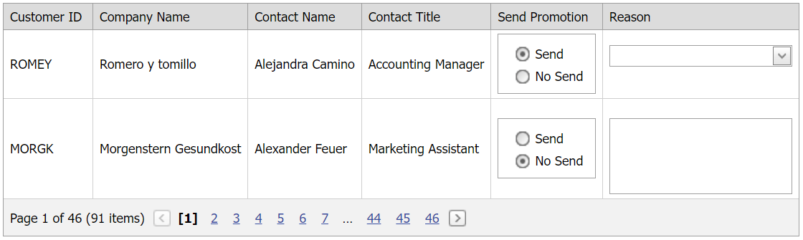

<!-- default badges list -->

[](https://supportcenter.devexpress.com/ticket/details/E2284)
[](https://docs.devexpress.com/GeneralInformation/403183)
<!-- default badges end -->
# Grid View for ASP.NET Web Forms - Display an editor in a templated column based on another editor's value

This example demonstrates how to add editors to templated columns and show or hide an editor based on another editor's selection.



## Overview

Follow the steps below to show or hide template editors:

1. For two grid columns, specify their [DataItemTemplate](https://docs.devexpress.com/AspNet/DevExpress.Web.GridViewDataColumn.DataItemTemplate) properties and add editors to the templates.

    ```aspx
    <dx:GridViewDataTextColumn Caption="Send Promotion" VisibleIndex="4">
        <DataItemTemplate>
            <dx:ASPxRadioButtonList ID="ASPxRadioButtonList1" runat="server" OnInit="ASPxRadioButtonList1_Init">
                <Items>
                    <!-- ... -->
                </Items>
            </dx:ASPxRadioButtonList>
        </DataItemTemplate>
    </dx:GridViewDataTextColumn>
    <dx:GridViewDataTextColumn Caption="Reason" VisibleIndex="5">
        <DataItemTemplate>
            <dx:ASPxComboBox ID="ASPxComboBox1" runat="server" ValueType="System.String" OnInit="ASPxComboBox1_Init">
                <Items>
                    <!-- ... -->
                </Items>
            </dx:ASPxComboBox>
            <br />
            <dx:ASPxMemo ID="ASPxMemo1" runat="server" Height="71px" Width="170px" OnInit="ASPxMemo1_Init">
            </dx:ASPxMemo>
        </DataItemTemplate>
    </dx:GridViewDataTextColumn>
    ```

2. For all editors, handle their server-side `Init` events and do the following in the handlers:

   * Access an editor's template container and get the container's visible index.
   * Specify an editor's `ClientInstanceName` property based on the container's visible index.

    ```cs
    protected void ASPxComboBox1_Init(object sender, EventArgs e) {
        ASPxComboBox cmb = (ASPxComboBox)sender;
        GridViewDataItemTemplateContainer templateContainer = (GridViewDataItemTemplateContainer)cmb.NamingContainer;
        cmb.ID = string.Format("cmb_{0}", templateContainer.VisibleIndex);
        cmb.ClientInstanceName = string.Format("cmb_{0}", templateContainer.VisibleIndex);
    }
    ```

3. For the radio button editor, handle its client-side [SelectedIndexChanged](https://docs.devexpress.com/AspNet/js-ASPxClientListEdit.SelectedIndexChanged) event. In the handler, call [SetVisible](https://docs.devexpress.com/AspNet/js-ASPxClientControlBase.SetVisible(visible)) methods to show or hide other editors based on the selected value in the radio button editor.

    ```cs
    protected void ASPxRadioButtonList1_Init(object sender, EventArgs e) {
        ASPxRadioButtonList rb = (ASPxRadioButtonList)sender;
        GridViewDataItemTemplateContainer templateContainer = (GridViewDataItemTemplateContainer)rb.NamingContainer;
        rb.ID = string.Format("rb_{0}", templateContainer.VisibleIndex);
        rb.ClientInstanceName = string.Format("rb_{0}", templateContainer.VisibleIndex);
        rb.ClientSideEvents.SelectedIndexChanged = string.Format("function(s, e) {{ OnSelectedIndexChangedEventHandler({0}, '{1}'); }}", rb.ClientInstanceName, templateContainer.VisibleIndex);
    }
    ```

    ```js
    function OnSelectedIndexChangedEventHandler(radioButtonList, rowVisibleIndex) {
        var comboBox = ASPxClientControl.Cast('cmb_' + rowVisibleIndex.toString());
        var memo = ASPxClientControl.Cast('memo_' + rowVisibleIndex.toString());
        var selectedItem = radioButtonList.GetSelectedItem();
        if (selectedItem) {
            switch (selectedItem.value) {
                case '0':
                    comboBox.SetVisible(false);
                    memo.SetVisible(true);
                    break;
                case '1':
                    comboBox.SetVisible(true);
                    memo.SetVisible(false);
                    break;
            }
        }
    }
    ```

## Files to Review

* [Default.aspx](./CS/WebSite/Default.aspx) (VB: [Default.aspx](./VB/WebSite/Default.aspx))
* [Default.aspx.cs](./CS/WebSite/Default.aspx.cs) (VB: [Default.aspx.vb](./VB/WebSite/Default.aspx.vb))

## Documentation

* [Grid View Templates](https://docs.devexpress.com/AspNet/3718/components/grid-view/concepts/templates)

## More Examples

* [Grid View for ASP.NET Web Forms - How to hide template controls in the specified cells](https://github.com/DevExpress-Examples/how-to-hide-template-controls-in-individual-cells-e1385)
